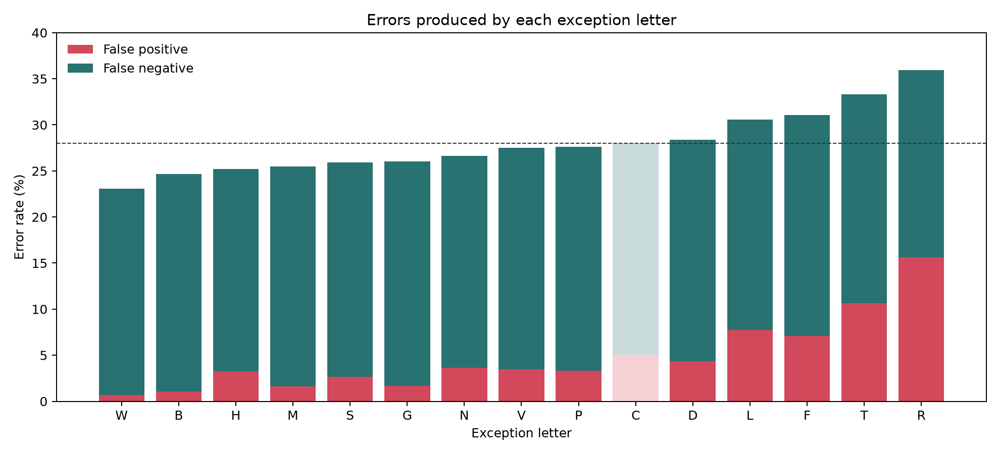

# “I Before E Except After C” Is a Lie

“I before E, except after C” is a lie. Worse, C is not even the best exception.

I tested the rhyme against Google Books’ 50,000 most common English words, treating every “ie” or “ei” as a spelling decision in a dictation competition. Nine letters produced fewer errors than C. W performed best, while B gives a better rule that still rhymes.

The results explain why familiar examples such as `WEIRD`, `SCIENCE`, and `THEIR` are not isolated annoyances. They are evidence that one of English spelling’s best-known rules teaches the wrong exception.

## Which letters are considered?

The analysis considers B, C, D, F, G, H, L, M, N, P, R, S, T, V, and W. Each letter appears immediately before “ie” or “ei” in at least 30 distinct words. This minimum prevents a letter from receiving a high score based on only a few examples.

A, E, I, J, K, O, Q, U, X, Y, and Z are excluded because each precedes “ie” or “ei” in fewer than 30 words. I, J, and Q do not precede either pair at all. The threshold excludes letters with too little evidence, including letters that would barely change the basic “i before e” prediction.

## What counts as an error?

Imagine a dictation competition containing the 2,091 relevant words. Whenever “ie” or “ei” occurs, the contestant must choose its order. They follow the proposed rule exactly: “ei” after the exception letter and “ie” everywhere else. An error means reversing those two letters and losing the point for that decision. Other possible spelling errors are outside this experiment.

In statistical language, the rule is a *binary classifier*: it chooses between two possible spellings. Taking “ei” as the positive result gives four possible outcomes:

- A **true positive** occurs when the rule predicts “ei” after C and the word really uses “ei,” as in `CEILING`.
- A **true negative** occurs when the rule predicts “ie” away from C and the word really uses “ie,” as in `BELIEVE`.
- A **false positive** occurs when the rule predicts “ei” after C but the word really uses “ie,” as in `SCIENCE`.
- A **false negative** occurs when the rule predicts “ie” away from C but the word really uses “ei,” as in `WEIRD`.

False positives and false negatives are collectively called *misclassifications*. In the dictation competition, each misclassification is one lost point. The error rate is lost points divided by 2,113 spelling decisions; accuracy is points won divided by 2,113 decisions.

Consider C. Of the 520 “ei” occurrences, the 35 preceded by C, such as those in `CEILING`, `RECEIPT`, and `RECEIVE`, are true positives. The other 485 are false negatives: the rule predicts “ie,” but the spelling is “ei.” Another 107 “cie” occurrences, including those in `SCIENCE`, `SOCIETY`, and `ANCIENT`, are false positives: the rule predicts “ei,” but the spelling is “ie.” Thus:

```text
errors = (520 - 35) + 107 = 592
error rate = 592 / 2,113 = 28.0%
accuracy = 1 - 28.0% = 72.0%
```

An exception improves accuracy only when its additional true positives outnumber its additional false positives.

## Letters that outperform C

Nine eligible letters produce fewer errors than C. C is included as the final row for comparison. TP, TN, FP, and FN mean true positive, true negative, false positive, and false negative.

| Letter | Accuracy | TP, with examples | FP, with examples | FN, with examples | TN |
| --- | ---: | --- | --- | --- | ---: |
| W | 76.9% | 47: `DEADWEIGHT`, `WEIRD`, `WEIGHTS` | 15: `HOWIE`, `WIELD`, `WIELDED` | 473: `SEIN`, `HEIRS`, `EIRE` | 1,578 |
| B | 75.3% | 21: `BEIJING`, `DABEI`, `ALBEIT` | 22: `ZOMBIE`, `RUBIES`, `AMBIENT` | 499: `NEIGHBORHOOD`, `NEIGHBORING`, `RECEIVERS` | 1,571 |
| H | 74.8% | 56: `SHEILA`, `HEINOUS`, `HEIFER` | 69: `ACHIEVEMENT`, `HEALTHIER`, `HIEROGLYPHICS` | 464: `LEIGH`, `PEI`, `REIS` | 1,524 |
| M | 74.5% | 16: `ALLGEMEINE`, `MEISSNER`, `GEMEINSCHAFT` | 34: `ENEMIES`, `PREMIERS`, `PREMIERSHIP` | 504: `FORFEITURE`, `LEIBNIZ`, `LEIPZIG` | 1,559 |
| S | 74.1% | 28: `HUSSEIN`, `SEIDEL`, `CONSEIL` | 56: `FANTASIES`, `SIE`, `BIOPSIES` | 492: `REINFORCE`, `WELLBEING`, `RHEIMS` | 1,537 |
| G | 74.0% | 5: `GEIGER`, `GEISHA`, `AGEING` | 35: `ORGIES`, `BOOGIE`, `METHODOLOGIES` | 515: `REIHE`, `BIRTHWEIGHT`, `WELLBEING` | 1,558 |
| N | 73.4% | 34: `NEI`, `NEIGHBOURS`, `HOMOGENEITY` | 77: `NIECE`, `INCONVENIENCES`, `NIE` | 486: `VEILS`, `BEIN`, `RHEIMS` | 1,516 |
| V | 72.5% | 12: `VEINS`, `UVEITIS`, `VEILED` | 73: `PURVIEW`, `VIEWERS`, `INTERVIEWS` | 508: `SOVEREIGNTY`, `RECUEIL`, `LEICESTER` | 1,520 |
| P | 72.4% | 6: `PEI`, `TAIPEI`, `PEINTURE` | 70: `SPIE`, `MASTERPIECES`, `FRONTISPIECE` | 514: `FINKELSTEIN`, `HOMOCYSTEINE`, `O'NEIL` | 1,523 |
| **C** | **72.0%** | **35:** `CONCEIVED`, `CONCEIVE`, `CONCEITS` | **107:** `LATENCIES`, `PROFICIENCY`, `INSUFFICIENT` | **485:** `EISENSTEIN`, `BEIGE`, `WEIL` | **1,486** |

The baseline “i before e” rule is correct for 75.4% of these spelling decisions. “W” wins because its 47 additional true positives exceed its 15 additional false positives, reducing total misclassifications by 32. “C,” despite owning the rhyme, produces 72 more misclassifications than using no exception at all.



## Conclusion

W is the best candidate in this dataset. “I before E, except after W” classifies 76.9% of the spelling decisions correctly, compared with 72.0% for C. W produces 488 errors, while C produces 592. If the rule must rhyme, B is the best alternative at 75.3%: “I before E, except after B.” Even G at 74.0% or P at 72.4% performs better than C. None is a reliable spelling rule, but C is not the best-supported exception among letters with at least 30 examples.

---
